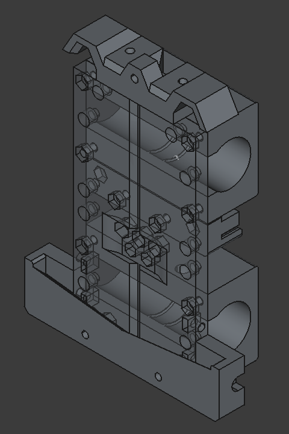
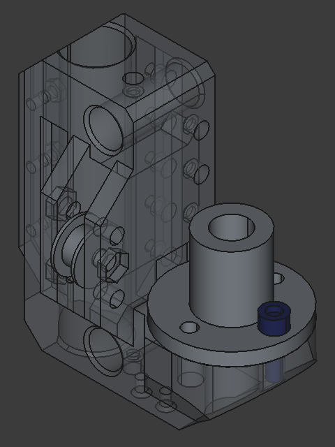

# TAZ6-Evolution

- [Purpose](#purpose)
- [Summary](#summary)
- [Caution!](#caution)
- [Design Philosophy](#design-philosophy)
- [Current Progress](#current-progress)
- [BOM](#bom)
- [Printed Parts](#printed-parts)
- [Assembly Instructions](#assembly-instructions)
  - [Required Tools](#required-tools)
  - [Disassembly](#disassembly)
  - [Heat Set Inserts](#heat-set-inserts)
    - [Z1 Axis](#z1-axis)
    - [Bearing Block](#bearing-block)
    - [Mounting Plate](#mounting-plate)
  - [Assembly](#assembly)
    - [X-Axis Carriage](#x-axis-carriage)
    - [Z1-Axis Traveler](#z1-axis-traveler)
    - [X-Z Axis Tuning](#x-z-axis-tuning)
    - [Belt Binder](#belt-binder)
    - [Accessories](#accessories)

## Purpose

Allow the Lulzbot TAZ6 to experimentally support other tool options, and to improve the rigidity and performance of the toolhead.

## Summary

A series of evolutionary modifications for the Lulzbot TAZ6 and possibly other TAZ series 3D printers. The goal of the modifications are to allow adapting the printer to different toolhead designs by introducing modifications to the X-axis carriage, and to improve the rigidity of the toolhead by creating additional mount points. As a prerequisite, modifications must be made to the Z-axis to adjust the angle and position of the X-axis belt. The result is a series of evolutionary steps necessary to redesign the Taz while maintaining existing functionality at each step.

## Caution!

These designs have not yet been tested beyond one TAZ6 printer, and required troubleshooting and problem solving at each step. Individualized tweaks to the design may be required for your printer which were not required for mine. If you disassemble parts such as the original X-axis carriage to use the existing Igus bearings, this may destroy the part. These designs come without warranty, and any loss or damage is your responsibility.

* This design does not take into account the X or Z-max endstops, which are not used by Klipper
* Work on the left hand (motor side) Z-traveler is incomplete and untested

## Design Philosophy

* Move forward in reversable steps
* Reuse hardware from the original printer where possible
* Predict future use cases without setting specific untested requirements
* Design iteratively and start from scratch often
* (1) Make it work, (2) make it correct, (3) make it perform (pretty, optimal, light weight, etc...)

## Current Progress

- [x] Modification of the right Z-gantry traveler
  * reposition the idler pulley at the midpoint between the X rails.
  * convert the composite Igus bearing to LM10LUU (55mm) linear bearings to simplify design and assembly.
  * add affordances for future modifications (motor mount, dual X axis pulleys).
- [x] Modification of the X-carriage
  * reduce the overall width of the X carriage to 60 mm.
  * improve vertical and horizontal symetry of the carriage.
  * align the belt with the midpoint of the X-axis rails
  * improve the belt binder to reduce flexibility
  * add mount points for hard mounting components
- [x] Modification of the tool mount plate
  * add mount points to the plate to allow tools to be directly mounted to the plate.
  * add mount points for TAZ quick tool change mounts.
- [ ] Modify motor mount for right side (Z0)
  * adjustable belt tension on motor mount
  * support mulitple motor / belt positions
- [ ] Modify motor mount for left side (Z1)
  * support dual stepper motors
  * adjustable belt tension on motor mount

## BOM

* An assortment of M3 hex socket screws sizes 4mm - 25mm including nuts
* (8) M3 x 35mm hex socket screws
* A handful of M3 poly washers
* A bunch of M3 5.5mm x 4mm heat set inserts
* (4) M5 heat set inserts (mine are M5 x 9.5) 
* (2) M5 x 25mm hex socket screw
* (2) M5 nylon lock nuts 
* (1) 20T GT2 idler pulley with 5mm bore
* (2) LM10LUU linear bearings
* (4) LM12UU IGUS solid polymer bearings RJ4JP
* (1) Lulzbot TAZ6 printer
* This list could be incomplete

## Printed Parts

| Qty | Material | Name | Desc |
|---|---|---|---|
| 2 | PETG | TAZ6-x-carriage-v0.5-BearingUniversal | Igus bearing block |
| 1 | PLA / ABS | TAZ6-x-carriage-v0.5-BeltTensioner | Belt tensioner / retainer |
| 1 | PLA / ABS | TAZ6-x-carriage-v0.5-EndStopClicker | Only necssary when not using the TazMount toolhead adapter |
| 1 | PLA / ABS | TAZ6-x-carriage-v0.5-MountingPlate | X-axis carriage mounting plate |
| 1 | PLA / ABS | TAZ6-x-carriage-v0.5-TazMount | Lower mounting bracket for TAZ quick mout toolheads |
| 1 | PLA / ABS | TAZ6-x-carriage-v0.5-TazMountTop | Upper mount point for TAZ quick mount toolheads |
| 1 | PETG | TAZ6-z-axis-v0.3-Z1-Axis | Right (Z1) axis |
| 0 | PETG | TAZ6-z-axis-v0.4-Z0-Axis | Left (Z0) axis - *unused* |

## Assembly Instructions

*These aren't really instructions per se, more like guidelines.*

### Required Tools

* 2.5 mm hex key
* 3 mm hex key
* 4 mm hex key
* Adjustable wrench or metric socket set
* Low temp soldering iron for insets
* Cubes of equal height (at least 40mm) that you can use as standoffs (such as stacked calibration cubes)

### Disassembly

Adjust the gantry height so that the standoff cubes are just barely held in place between the lower X-axis rod and the green lower Z-axis assembly on the right hand side. This will be used later in the process to ensure that the rods are attached squarely.

Disassemble and remove the X-axis belt, the X-axis rods, the X-axis carriage (removed from the rods), and the right top plate.

Unscrew the two M5 screws from the right lead screw nut (threaded flange). Reserve these screws. Remove the right Z-axis traveler. Reserve the green lead screw spacer.

Unplug the right stepper motor connector.

### Heat Set Inserts

Note: There are many available positions for heat set inserts - more than you will actually need. Install only the ones necessary for your specific use case at this point.

#### Z1 Axis

* (2) M3 inserts for securing the rods. (top and bottom)
* (2) M5 insers for attaching the lead screw nut. (12:00 and 6:00 position when facing the printer)

#### Bearing Block

* (2) M3 inserts on the top of one universal bearing block (this block will now be the top block)

#### Mounting Plate

All inserts on the mounting plate are optional. Hex nuts are used for all pull-through hardware and for convenience during prototyping. Mounting the *TAZ-EVO* toolhead components requires use of insets. 

### Assembly

#### X-Axis Carriage

* Sand and trim the inside of both `BearingUniversal` blocks.
* Snap Igus bearings in place. (Be careful as they do easily pinch skin)
* Test the blocks on one loose end of a rod. If the block is too tight / does not travel easily, remove the bearings and perform some additional sanding and trimming on the retaining rings inside the block.
* Fit (2) M3 nuts for the TAZ mount into the *back* of `MountingPlate` (the back is the side without the groove).
* Attach the bearing blocks with (4) M3 x 35mm screws and (4) M3 nuts for each block. The screws should be somewhat loose but still engaged in the nuts.

#### Z1-Axis Traveler

* Fit (1) LM10LUU bearing into position and secure with (3) M3 x 10mm screws and (3) M3 x 10mm nuts
* Fit (1) M5 x 25mm screw in place with the idler pulley in the center position and secure with the lock nut.
* Screw (2) M3 x (smallest that works) screw in each heat set insert. Test that when tightened the screw engages the rod and prevents movement. Leave loose.
* Slide the Z-axis traveler over the two rods, and slide it down to the bottom.
* Insert the X-axis rods through the traveler from the right hand side, so that they extend on each side.
* Slide the X-carriage over the the X-axis rods.
* Slide the X-axis rods throug the right Z-traveler until they reach the left Z-traveler, and use the standoff blocks to ensure that the rods are at the correct height.
* Add the green lead screw spacer, and then thread the lead screw nut until it is approximately in position. Thread the reserved M5 screws into the nut and adjust them until they are just loose.
* Using the spacer between the X-axis rods, and any other measurement tools at your disposal, ensure that the X-axis is square and level. Tighten grub screws on the left side and the M3 screws on the right side to secure the rods in place. 
* Ensure that the X-carriage still travels freely, and the lead screw turns easily.
* Reinstall the top plate on the Z-axis, ensuring that the extrusions are square when tightening.
* Follow the instructions below for tuning the X-Z axis

#### X-Z Axis Tuning

The X and Z axes intersect at the junction of the X-axis rails, and the Z-axis rail and lead screw. The Z-traveler holds the Z-axis linear bearing, the lead screw nut, the X-axis linear rails, and secures the belt. All of these parts must be properly aligned for the Z-traveler to move freely in the Z direction.

* At each step durring the assembly, the lead screw should be checked to ensure it rotates freely by turning it back and forth slightly. It should turn easily. If it is difficult to turn, the previous step introduced binding.
* Disconnnecting the power connector from the motor will ensure that there is not additional electromagnetic load on the motor (even when the printer is off)
* The X-axis rails oppose the force applied by the belt. If there is tension on the belt when the rails are loose, this can cause leadscrew binding. *You must loosen the belt before loosening the X-axis rails.*
* The X-axis belt must be loose when tuning the X-Z Axis.
* The squishy yellow-green spacer allows the leadscrew nut *tilt* to be properly aligned.
* When tightening the M4 screws on the lead screw nut, tighten them a quarter turn at a time, alternating between each, and checking the lead screw binding at each step. If the lead screw binds, loosen the screw and tighten the *opposite* screw.

#### Belt Binder

* The binding block holds the belt securely in place, and provides coarse tuning for belt tension.
* The stepper motor mount provides fine tuning for belt tension.
* Loosen the X-Axis stepper motor screws
* Thread the belt through the idler pulley on the right Z-axis
* Secure each end of the belt into the binding block so that the belt is as tight as possible.
* Use (2) M3 x 16mm screws, (2) M3 poly washers and (2) M3 nuts to secure the belt to the block, so that the head of the screw faces backward and the nut faces forward, and the tail of the belt goes to the top.
* Adjust the tension by pulling the stepper motor to the left. If There is not enough tension on the belt, loosen the motor mount and adjust the belt position on the block by 1 tooth. If necessary, move three of the stepper screws so that the motor rotates and provides additional slack to adjust the belt.

#### Accessories

* Ensure that either `TazMount` or `EndStopClicker` is installed before homing the printer *or you will hear bad noises*.
* Use (2) M3 x 12mm screws to attach either part to the toolhead.
* Move the X-carriage all the way to the left to test contact with the X-min microswitch.
